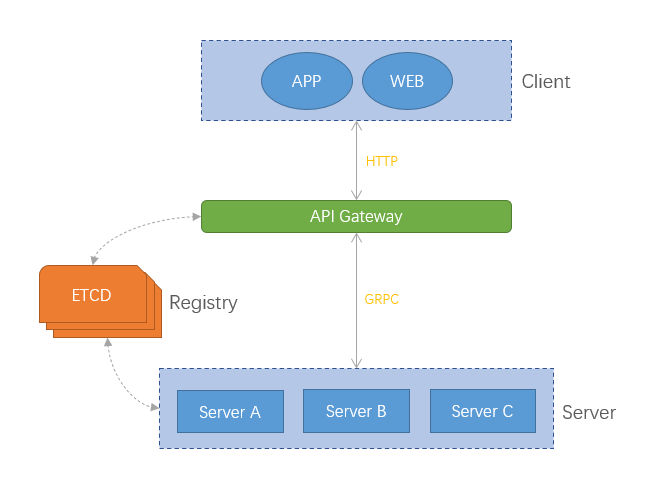

# Bull(公牛)微服务框架
## 背景
* 从2018年开始，本人一直基于go-micro做微服务开发。
* go-micro是一个不错的微服务框架，但是对我个人而言go-micro太过于臃肿，我并不需要那么多功能。
* 在2021年牛年之际，我打算开发一个精简版的微服务框架。
* 由于2021年是牛年所以就将框架的名称命名为`bull`即公牛的意思。

## 简介
Bull一款基于GO语言的极简微服务框架。

使用GRPC作为RPC协议，使用ETCD作为注册中心。

框架目前已经实现了服务注册、服务发现（客户端轮训）功能。

计划实现：API Gateway、配置中心、服务监控等功能。

## 整体架构


## 使用说明
### 安装etcd
[https://github.com/etcd-io/etcd/releases](https://github.com/etcd-io/etcd/releases)

### 获取bull框架
```text
go get github.com/w3liu/bull
```

### 定义proto协议
```text
syntax = "proto3";

package person;

service Person {
  rpc SayHello(SayHelloRequest) returns (SayHelloResponse) {}
}

message SayHelloRequest {
  string name = 1;
}

message SayHelloResponse {
  string msg = 2;
}
```

### 生成grpc代码
```text
protoc --proto_path=. --go_out=plugins=grpc:. *.proto
```

### 服务端代码
```text
package main

import (
	"github.com/w3liu/bull"
	"github.com/w3liu/bull/examples/handler"
	pb "github.com/w3liu/bull/examples/proto"
	"github.com/w3liu/bull/registry"
	"google.golang.org/grpc"
)

func main() {
	r := registry.NewRegistry(registry.Addrs([]string{"127.0.0.1:2379"}...))
	service := bull.NewService(
		bull.Registry(r),
	)
	server := service.Server()
	grpcServer, ok := server.Instance().(*grpc.Server)
	if !ok {
		panic("not grpc server")
	}
	pb.RegisterPersonServer(grpcServer, &handler.Person{Name: "Foo"})
	err := service.Run()
	if err != nil {
		panic(err)
	}
}
```

### 客户端代码
```text
package main

import (
	"context"
	"fmt"
	"github.com/w3liu/bull/client"
	pb "github.com/w3liu/bull/examples/proto"
	"github.com/w3liu/bull/registry"
	"google.golang.org/grpc"
	"time"
)

func main() {
	r := registry.NewRegistry(registry.Addrs([]string{"127.0.0.1:2379"}...))
	cli := client.NewClient(
		client.Registry(r),
		client.Service("hello.svc"))

	conn, ok := cli.Instance().(*grpc.ClientConn)
	if !ok {
		panic("not grpc client conn instance")
	}
	personClient := pb.NewPersonClient(conn)

	for i := 0; i < 10; i++ {
		ctx, _ := context.WithTimeout(context.TODO(), time.Second*5)
		rsp, err := personClient.SayHello(ctx, &pb.SayHelloRequest{
			Name: "Bar",
		})
		if err != nil {
			panic(err)
		}
		fmt.Println(rsp)
	}
}
```

### 测试用例
* 打开`service_test.go`文件，分别运行`TestService1` `TestService2` `TestService3` 会启动三个后端服务
* 若启动成功，查看`./log/info.log`，会有如下日志：
```text
2021-03-12 17:17:48.854	INFO	bull/service.go:96	Starting [service] hello.svc_0
2021-03-12 17:17:48.861	INFO	server/grpc_server.go:101	Server [grpc] Listening on [::]:50743
2021-03-12 17:17:48.871	INFO	server/grpc_server.go:294	Registry [etcd] Registering node: hello.svc_0-10b9a275-0b29-4394-b11e-bbb517d1e7fb
2021-03-12 17:17:48.873	INFO	registry/etcd_registry.go:223	Registering hello.svc_0 id hello.svc_0-10b9a275-0b29-4394-b11e-bbb517d1e7fb with lease cluster_id:14841639068965178418 member_id:10276657743932975437 revision:22 raft_term:4  and leaseID 7587853048034846508 and ttl 30s
```
* 运行`TestClient`，查看调试窗口，会有如下输出：
```text
API server listening at: 127.0.0.1:50117
=== RUN   TestClient
msg:"Foo1 say hello to Bar" 
msg:"Foo3 say hello to Bar" 
msg:"Foo1 say hello to Bar" 
msg:"Foo3 say hello to Bar" 
msg:"Foo1 say hello to Bar" 
msg:"Foo3 say hello to Bar" 
msg:"Foo1 say hello to Bar" 
msg:"Foo3 say hello to Bar" 
msg:"Foo1 say hello to Bar" 
···
```


